 

## Trois ingénieurs, pas d’intermédiaires

Olixid est un cabinet de conseil et d’ingénierie IA basé à Paris. On est trois ingénieurs IA formés à l’EPITA, et ce sont nos mains qui conçoivent, codent et déploient les systèmes.

On commence par chercher où l’IA fait vraiment gagner du temps ou de l’argent dans l’entreprise. Ensuite on construit le système, on le branche sur les outils déjà en place (ERP, CRM, messagerie, logiciels métier, Excel) et on le fait tourner en production.

## Ce qu’on construit

| Domaine | Ce que ça fait |
|---|---|
| **Agents métier** | branchés sur l’ERP, le CRM et la messagerie, ils traitent les tâches répétitives de bout en bout |
| **Documents** | factures, devis, dossiers, contrats, même manuscrits : lus, structurés, vérifiés et saisis |
| **Assistants internes** | ils répondent à partir de la documentation de l’entreprise, en citant leurs sources |
| **Vision par ordinateur** | contrôle qualité, comptage, suivi de ligne |
| **Prévision et anomalies** | demande, stocks, maintenance |
| **Petits modèles sur mesure** | des SLM entraînés pour un client, servis sur son infrastructure ou en Europe |

Les données d’un client restent chez lui ou en Europe, et elles servent uniquement à ses propres systèmes.

## Ce que ça donne

 

> [!NOTE]
> **Un cas réel, chiffres validés par le client.** Chez Guenifey (généalogie successorale, environ 200 salariés), les dossiers d’héritiers arrivent par mail en PDF : actes d’état civil, livrets de famille, pièces d’identité, souvent anciens et en partie manuscrits. Le système les lit, les structure, les contrôle et les saisit dans le logiciel métier par son API. Résultat : 30 minutes de moins par dossier, environ 2 heures récupérées chaque semaine, zéro erreur de saisie. Construit en deux mois environ, il tourne dans l’environnement Microsoft du client.

Ils nous ont fait confiance : **Air France**, **International SOS**, **INRAE**, **IONIS**, **Guenifey**, **Centralp**. Certaines de ces missions sont passées par la Junior-Entreprise que nous avons créée.

## L’atelier

Nos outils internes portent des noms de dieux égyptiens. Chacun a hérité du métier de son patron.

| | Dépôt | Ce qu’il fait |
|---|---|---|
| 🔨 | **Ptah**, dieu des bâtisseurs | notre catalogue de plugins Claude Code, installé chez toute l’équipe |
| 🪶 | **Thoth**, dieu des scribes | l’envoi des mails, les relances et le tri des réponses |
| 👁️ | **Horus**, l’œil qui voit loin | un radar qui repère les événements qui créent un besoin chez nos clients |
| ⚖️ | **Maât**, l’ordre du monde | la to-do de l’équipe, en temps réel |
| ✨ | **Heka**, la magie | une plateforme de decks générés et pilotables par IA |
| 📜 | **Hermès**, le messager | un agent de prospection qui propose, et un humain qui valide |

Ces dépôts restent privés. Ce qu’on publie :

- [**claude-outreach**](https://github.com/olixid/claude-outreach) : toute la prospection B2B depuis Claude Code (ciblage, sourcing, emails vérifiés, séquences, délivrabilité, réponses, RGPD). Licence MIT.
- Nos forks de travail de [Dokploy](https://github.com/olixid/dokploy), [Aegra](https://github.com/olixid/aegra) et [Onyx](https://github.com/olixid/onyx) : c’est sur eux qu’on héberge et qu’on fait tourner nos agents.

## L’équipe

| Qui | Spécialité |
|---|---|
| **Louis** | fondateur, architectures IA |
| **Quentin** | agents IA et automatisation |
| **Guillaume** | vision par ordinateur et déploiement |

 

**Un premier appel de 30 minutes, sans engagement.** On répond sous 24 heures ouvrées.

 

In English

 

Olixid is an AI consulting and engineering firm in Paris. Three EPITA-trained AI engineers find where AI saves a company time or money, then design, build and run the system in production, inside the tools the company already uses. Success criteria are set in numbers before any code is written, prototypes run on real data, and models stay on the client's infrastructure or in Europe. Write to [contact@olixid.com](mailto:contact@olixid.com).

